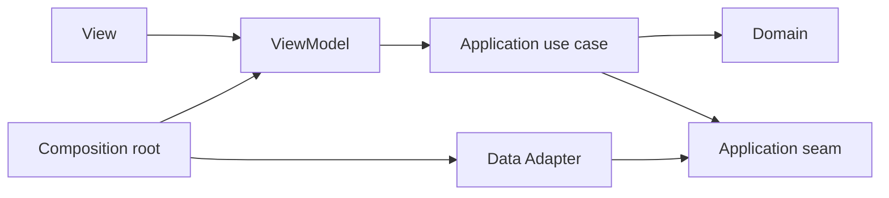

# 技术架构与非功能约束

> 状态：`Baselined — 5d11769`
> 最后更新：2026-09-13

本文件是运行时边界、依赖方向、composition root 与系统非功能约束的唯一真相。产品行为仍以
[`CONTEXT.md`](../../../CONTEXT.md) 和[产品知识库](../../knowledge_base/locatemy_product/README.md)为准；
数据对象只在 [Schema Catalog](../data/schema-catalog.md) 定义，跨模块用途只在
[Interface 注册表](interfaces.md)登记。

## 运行时与外部系统

| 边界 | 责任 | 明确不承担 |
| --- | --- | --- |
| Flutter Android 应用 | 呈现、ViewModel、领域规则、前台同步、SQLite/文件/键值本机状态，以及通过公开 Interface 组合 Feature | 后台常驻同步、政府数据导入、service-role 权限、把本机缓存当权威业务记录 |
| Supabase Auth | 邮箱密码身份、邮箱确认状态与当前设备会话 | 应用导航、账户业务资料、退出时的 Feature 本机清理 |
| Supabase Data API / Postgres | 账户业务记录的权威来源；维护者一次性导入的政府镜像；稳定的只读 View/RPC | Flutter 直写政府镜像、自动数据同步、以 RLS 代替客户端账户门控 |
| Supabase Storage | 房产实勘私有照片的权威文件 | 房产字段、照片说明/封面、离线待传状态 |
| OpenStreetMap tiles | 主地图和 Feature 局部地图底图 | 周边设施查询、路线规划、离线地图 |
| Geoapify | 限于马来西亚的地点候选 | 最终马来西亚范围判定、行政区/州统计口径 |
| Overpass / OSM | 2 公里周边设施原始元素 | 政府统计、设施质量/营业状态、账户资料 |
| 官方 GTFS Static feeds | 维护者手动准备标准化交通结果的原始来源 | Flutter 运行时下载/解析、后台更新、实际通勤评价 |

政府数据和 GTFS 的准备是受控、一次性的维护操作。Flutter 只消费 Schema Catalog 中登记的稳定
公共读取对象；导入失败或资料不完整表现为分类不可用，不能表现为空结果。

## 目录与模块责任

| 区域 | 唯一责任 | 允许依赖 |
| --- | --- | --- |
| `lib/main.dart` | 最小进程入口；把控制交给 composition root | `lib/app/` 的公开启动入口 |
| `lib/app/` | composition root、Application Shell、认证/账户范围门控、全局导航、本地化、跨 Feature 工作流与前台同步触发 | `core` 与各 Feature 的公开 Interface；不读取 Feature 内部模型 |
| `lib/core/` | 无产品归属的窄基础能力：结果/时钟/网络状态抽象、存储连接、国际化基础和清洗后的诊断事件 | Dart/Flutter 与外部包；不拥有业务规则、业务状态或 Feature 用例 |
| `lib/features/<feature>/` | 一个 Feature 或 shared module 的 Presentation、Application、Domain 与 Data 实现 | `core` 和已冻结的上游公开 Interface；不导入其他 Feature 内部目录 |
| `supabase/migrations/` | 可由 AI 或 Owner 编写的可执行远端 schema、RLS、View/RPC 和 Storage policy | 已批准 Schema Catalog；不反向定义产品行为 |
| `test/`、`supabase/tests/` | 通过公开 Interface 验证 Feature、组合流程、RLS allow/deny 和数据契约 | 与生产调用方相同的 seam |

Application Shell 与 Account Privacy 是 [Feature map](feature-map.md) 中有独立 Interface 的 shared
module；composition root 只接线，不吸收两者规则或把它们降成通用工具。

## MVVM 与依赖方向

每个 Feature 内使用 `View → ViewModel → Application use case → Domain`。Data Adapter 从外侧满足
Application 所声明的 seam；Domain 不依赖 Flutter、Supabase、SQLite、文件系统或网络包。

- View 只绑定可呈现状态和用户意图；异步、重试、缓存与账户判断进入 ViewModel/use case。
- ViewModel 只暴露一个页面或工作流需要的状态，不返回 Supabase row、SQLite row 或第三方 payload。
- 跨 Feature 调用只经过 [Interface 注册表](interfaces.md)；同一分析结果计算一次并连同地点、日期、
  口径、来源、可用性和原因传递。
- 外部 seam 在有生产与确定性测试两个 Adapter 时成立；composition root 选择 Adapter，调用方不选择。
- Feature 的公开 Interface 是调用方与测试共同的 seam；测试不得绕过它来绑定内部 Data Adapter。

## Composition root 与生命周期

composition root 按固定顺序建立：配置与基础 Adapter → Authentication & Session → Account Privacy →
Application Shell → Wave 4–7 Feature。配置失败停在不可重试启动状态；不会建立半初始化主应用。

冷启动先恢复会话，再为同一账户打开 privacy scope；两者一致后才创建私有 Feature 的 ViewModel。
退出或切换账户先关闭私有呈现和意图入口，再结束本机会话与关闭旧 scope。旧 scope `closed` 前不创建
新账户 ViewModel。公共缓存和设备语言 Adapter 是进程级；私有 Adapter 是账户 scope 级。

前台同步只在冷启动恢复已认证账户、登录后、应用回到前台和用户手动重试时触发。每个离线 Owner
独占队列与幂等语义；Application Shell 只排序触发并汇总状态，不读取 payload。

## 数据与安全边界

- Flutter 只使用 publishable/anon 客户端密钥；service-role 或数据库凭据不进入应用、仓库、日志或
  配置产物。Geoapify 客户端密钥按供应方允许的移动端限制配置，并可替换，不承担授权。
- 暴露 schema 中每个对象同时定义显式 grant 与 RLS。账户私有表以认证账户和不可变 owner 字段限制
  每项操作；`UPDATE` 同时限制原行和新行。公开隐患只允许已认证用户读取，修改仍限作者。
- 政府镜像只向已认证客户端授予读取，并通过 `security_invoker` View 或经审查的 RPC 暴露稳定形状；
  Flutter 不直接查询镜像表。公共 View 不携带账户字段。
- Storage 对象路径以不可变账户与实勘标识分区；读取、上传、替换、删除均需同一账户拥有父实勘。
  元数据行与文件操作分别报告结果，补偿流程保留可重试状态，不伪装原子成功。
- SQLite 私有对象均带账户分区并受已打开 scope 二次门控。队列 payload 不进入公共缓存；退出先阻断
  读取再清理。详细对象与权限只在 [Schema Catalog](../data/schema-catalog.md)定义。

## 可测试非功能约束

| 维度 | 系统约束 | 必须出现的验证证据 |
| --- | --- | --- |
| Security | 每个远端私有对象验证 owner allow、另一账户 deny、匿名 deny；公开隐患验证 authenticated read、author-only insert/delete 与仅自身状态更新，发布后内容不可变；客户端无高权限密钥 | 数据库 policy 测试与 Storage policy 测试分别覆盖 select/insert/update/delete；构建产物秘密扫描无 service-role/数据库凭据 |
| Account isolation | 私有内存、SQLite、队列和文件先按账户分区再按当前 scope 读取；换号不继承 ViewModel 或待处理意图 | 注入两个账户与每个私有 Owner；切换前后逐项证明旧值不可读、不可同步，清理失败时主应用仍关闭 |
| Offline | 读取优先使用仍有效或明确 stale 的缓存；只有收藏创建和照片待传使用已授权队列；编辑/删除及其他创建在线完成 | 飞行模式覆盖缓存命中/过期、收藏排队、照片待传、重复同步、进程重启与冲突；“已排队”从不显示“已创建” |
| Internationalization | 中文与 English 覆盖同一页面、动态状态、来源、错误、复数与恢复动作；设备语言偏好跨重启且跨账户保留 | 两种 locale 运行完整流程清单；缺少 key 在测试失败，日期/数字/复数按 locale 呈现 |
| Observability | 诊断事件使用稳定事件名、Feature、结果分类、耗时桶和清洗后的关联 ID；不记录密码、token、邮箱、自由文字、照片路径、精确坐标或队列 payload | 对成功、可重试、不可重试、缓存降级、同步冲突和 privacy failure 做事件断言；日志内容执行敏感字段 deny-list 测试 |
| Availability | 每个远端结果区分 fresh、cached/stale、complete empty、retryable unavailable、non-retryable unavailable；部分资料保留成功分项 | 每个分析 Interface 的契约测试覆盖全部适用分支，页面不会把未知/失败压成零或空列表 |
| Responsiveness | 首次加载显示局部状态，用户动作防重复提交；长查询可取消或忽略过期结果，旧地点结果不覆盖新地点 | 快速换地点、换账户、重复刷新和晚到响应测试；呈现只接受当前不可变请求上下文 |
| Accessibility | 360–430dp、动态字体 200%、键盘/屏幕阅读器可用；颜色不是唯一状态信号 | 关键页面小屏与 200% 字体检查；地图/图表有文字摘要，错误焦点进入首个无效字段 |

## 方案边界

项目不引入后台同步框架、ORM/Drift、额外状态管理框架、原生桥接、Edge Function、Realtime、自动政府
数据抓取或独立遥测平台。所需本机依赖限于产品事实规定的 `sqflite`、`path_provider`、
`shared_preferences`，以及实现已批准地图、网络与本地化能力的最小 Flutter 包；具体版本由实施者
查证并锁定。该限制不削弱收藏双向同步、照片待传、RLS、回收站或错误恢复。
