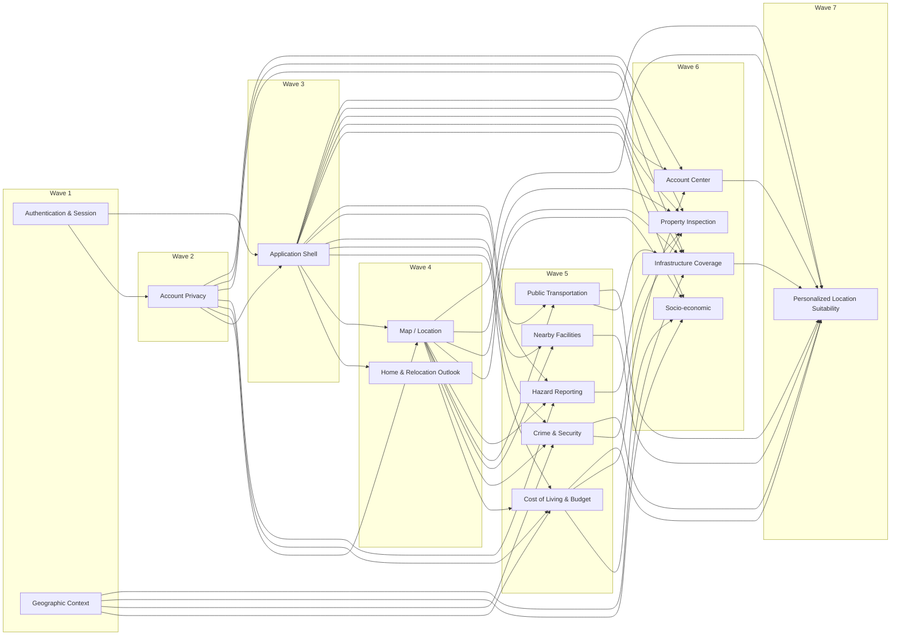

# Feature 与 shared module 边界

> 状态：`Draft — Issue #3 边界与 DAG 已批准`
> 最后更新：2026-09-14

本文件是 Feature/shared module 责任、直接设计依赖和设计波次的唯一真相。Capability 的产品含义与
可观测成果仍以 [Capability Catalog](../../knowledge_base/locatemy_product/capability_catalog.md) 为准；
跨 Feature 组合遵循[协作规范](../../knowledge_base/locatemy_product/cross_feature_collaboration.md)。

这里的责任 Owner 是设计模块，不是学生分工。两名学生的实现分配继续由项目负责人另行决定。
设计波次表示 owning document 最早可以进入详细设计的波次，不等于开发工期或提交顺序。

## 划分规则

- Feature 以可独立验证的用户能力纵切，不按页面、表、ViewModel 或开发者划分。
- shared module 只在多个 Feature 共用状态、规则、数据访问或公开契约时成立；删除它会把同一复杂度
  散回多个消费者。
- 直接依赖只表示：消费者的精确契约无法在上游 owning document 冻结前完成。运行时调用、共用工具、
  最终 composition root 接线和方便的先后顺序本身不构成边。
- Application Shell 先发布与领域无关的导航、组合槽位和账户门控 Interface；后续 Feature 向这些
  Interface 提交意图或结果。因此最终集成会引用 Feature，但不产生 Shell 对下游详细设计的反向阻塞边。
- 已验收 tracer 的 Application Shell、Authentication & Session、Map / Location、Nearby Facilities
  和 Account Privacy seam 保持不变；本次只向外补齐责任。

## Capability 唯一归属

| 责任 Owner | 类型 | Required Capability | 数量 |
| --- | --- | --- | ---: |
| Application Shell | shared module | `NAV-01`、`NAV-02`、`NAV-03` | 3 |
| Authentication & Session | Feature | `AUTH-01`、`AUTH-02`、`AUTH-03`、`ACCOUNT-07` | 4 |
| Home & Relocation Outlook | Feature | `HOME-01`、`HOME-02`、`HOME-03` | 3 |
| Map / Location | Feature | `MAP-01`、`MAP-02`、`MAP-03`、`MAP-04`、`MAP-05`、`MAP-06` | 6 |
| Personalized Location Suitability | Feature | `MAP-07` | 1 |
| Cost of Living & Budget | Feature | `COST-01`、`COST-02`、`COST-03`、`ACCOUNT-09` | 4 |
| Crime & Security | Feature | `SAFE-01`、`SAFE-03` | 2 |
| Socio-economic | Feature | `SOCIO-01`、`SOCIO-02`、`SOCIO-03` | 3 |
| Infrastructure Coverage | Feature | `INFRA-01`、`INFRA-02` | 2 |
| Nearby Facilities | Feature | `FAC-01` | 1 |
| Public Transportation | Feature | `TRANSIT-01`、`TRANSIT-02`、`TRANSIT-03` | 3 |
| Property Inspection | Feature | `PROP-01`、`PROP-02`、`PROP-03`、`PROP-04`、`PROP-05` | 5 |
| Hazard Reporting | Feature | `HAZ-01`、`HAZ-02`、`HAZ-03`、`HAZ-04` | 4 |
| Account Center | Feature | `ACCOUNT-01`、`ACCOUNT-02`、`ACCOUNT-08` | 3 |
| **合计** | 13 个 Feature、1 个有 Capability 的 shared module | **全部 44 项 `required`** | **44** |

Account Privacy 与 Geographic Context 没有直接 Capability；它们只因下方已证明的跨 Feature
责任成立。Application Shell 作为已验收 tracer 的 shared module，继续拥有三个全局导航 Capability。

## 责任卡

### Authentication & Session

- **类型 / 波次**：Feature / Wave 1。
- **用户成果**：用户能注册、登录、看到真实邮箱验证状态，并只结束当前设备会话。
- **拥有**：认证表单规则、Supabase Auth 会话结果、注册后的会话/待验证分支、当前设备退出结果。
- **不拥有**：主应用路由、账户业务资料、本机私有业务清理、其他设备会话。
- **输入**：规范化邮箱、仅本次提交使用的密码/确认密码、当前设备会话动作。
- **输出**：已认证账户引用、待邮箱验证状态、真实验证状态或分类失败；当前设备退出结果。
- **直接依赖**：无内部节点；Supabase Auth 是外部来源，不进入本 DAG。

### Geographic Context

- **类型 / 波次**：shared module / Wave 1；Capability：无。
- **用户成果**：各地区分析对同一坐标使用明确且互不混淆的行政区和州口径。
- **拥有**：从已验证地点引用解析州或行政区的规则、边界资料版本、未解析/多匹配语义及可测试 seam。
- **不拥有**：马来西亚范围校验、可变选点、地图图层、任何指标或地区统计回退规则。
- **输入**：调用方从合法地点引用取得的坐标值、所请求的地理口径；不读取 Map / Location 的可变状态。
- **输出**：带边界资料版本的 resolved context，或明确的 unresolved / ambiguous 原因；州与行政区各自返回。
- **直接依赖**：无内部节点；边界资料是外部输入。
- **成立依据**：Cost of Living & Budget、Crime & Security、Socio-economic、Infrastructure Coverage
  均需坐标到统计区域的解析。删除该模块会把边界版本与歧义规则复制到四个 Feature；生产边界解析与
  确定性测试 Adapter 也需要同一个 Interface。

### Account Privacy

- **类型 / 波次**：shared module / Wave 2；Capability：无。
- **用户成果**：只有当前认证账户的私有本机状态可读；退出或换号后旧账户内容不会泄漏或重放。
- **拥有**：账户范围开启/关闭协议、私有 Owner 登记、先阻断再清理、幂等汇总和未完成 Owner 结果。
- **不拥有**：认证凭据、各 Feature 的业务数据/队列 payload、远端记录删除、公共缓存和语言偏好。
- **输入**：认证账户引用、开启/关闭原因、已登记私有状态 Owner 的清理结果。
- **输出**：同账户 `opened`，或只有全部本机私有状态已处理才成立的 `closed`；否则为带 Owner 的失败。
- **直接依赖**：Authentication & Session（`D01`）。
- **成立依据**：Map / Location、Cost of Living & Budget、Infrastructure Coverage、Hazard Reporting、
  Property Inspection、Account Center 都拥有账户私有本机状态；删除该模块会把同一 privacy barrier
  和退出完成判断散到每个 Feature 与 Application Shell。

### Application Shell

- **类型 / 波次**：shared module / Wave 3。
- **用户成果**：用户只在安全账户范围内进入主应用，可保留首页/地图 Tab 状态，以选定语言完成同一组
  导航和跨 Feature 旅程。
- **拥有**：认证门控、双 Tab、设备语言偏好、业务导航意图、组合槽位、跨 Feature 工作流顺序和最终集成验收。
- **不拥有**：认证凭据、可变地点、分析公式/结果、Feature 私有资料、离线队列或学生分工。
- **输入**：会话与账户范围结果、类型化导航意图、带来源/日期/可用性的领域结果或事件。
- **输出**：门控状态、本地化导航状态、accepted/rejected/authentication-required 导航结果及组合呈现状态。
- **直接依赖**：Authentication & Session（`D02`）、Account Privacy（`D03`）。
- **成立依据**：所有 Feature 共用门控、导航和组合规则；删除该模块会把路由、账户切换和 A/B/摘要工作流
  散回多个页面。它不吸收提供方的领域语义，因此保持小 Interface。

### Home & Relocation Outlook

- **类型 / 波次**：Feature / Wave 4。
- **用户成果**：用户看到全国搬家时机、宏观指标、数据日期和可控刷新，并可进入地图探索。
- **拥有**：首页宏观数据读取、搬家时机模型、公共缓存、刷新与 60 秒冷却状态、首页可用/缺失结果。
- **不拥有**：地点分析、个人化地点适配度、地图状态、语言偏好或导航执行。
- **输入**：已导入的全国政府数据、缓存读取策略和用户刷新动作。
- **输出**：带单位/日期/来源/可用性的首页结果，以及“探索地图”导航意图。
- **直接依赖**：Application Shell（`D04`）。

### Map / Location

- **类型 / 波次**：Feature / Wave 4。
- **用户成果**：用户可在马来西亚地图点选或搜索地点，管理单点与 A/B、收藏地点并进入合法分析流程。
- **拥有**：可变地点上下文、Geoapify 候选接入、马来西亚范围校验、底图/选点/手势、单点与 A/B 角色、
  收藏权威记录的本机缓存与离线创建队列、分析目标快照和地图图层宿主。
- **不拥有**：行政区/州解析、六类分析结果、个人化地点适配度、隐患图层内容或应用级路由。
- **输入**：地图手势、地点名称候选、收藏动作、同步触发和业务图层贡献。
- **输出**：不可变合法地点引用、单点/A/B/收藏状态、同步状态、图层点击意图和分析导航意图。
- **直接依赖**：Application Shell（`D05`）、Account Privacy（`D06`）。

### Cost of Living & Budget

- **类型 / 波次**：Feature / Wave 5。
- **用户成果**：用户看到单点/A-B 生活成本，能临时换算月支出，并按账户管理和选择当前评估预案。
- **拥有**：生活篮子与成本/预算压力模型、3 天公共缓存、临时 CPI 换算输入、预算预案 CRUD、当前评估
  预案及其变更事件。
- **不拥有**：商品/商家下钻、地点选择、家庭收入百分位、适配度总分或账户评估偏好。
- **输入**：合法地点引用及其行政区、PriceCatcher/基准资料、临时月支出、预案字段和账户范围。
- **输出**：带覆盖率/单位/日期/可比性的单点或 A/B 结果、预算压力、临时换算结果、当前预案快照/变更。
- **直接依赖**：Application Shell（`D07`）、Map / Location（`D08`）、Geographic Context（`D09`）、
  Account Privacy（`D10`）。

### Crime & Security

- **类型 / 波次**：Feature / Wave 5。
- **用户成果**：用户看到地点所属统计州的安全指数、案件数、五年趋势和类别筛选；A/B 可比时并列。
- **拥有**：官方犯罪统计读取、州级安全模型、趋势/筛选语义和 3 天公共缓存。
- **不拥有**：公共隐患报告、行政区统计、房产记录、可变选点或个人受害概率推断。
- **输入**：合法地点引用、resolved state 和 `crime_district` 公共资料。
- **输出**：带统计州/年份/来源/完整性的安全结果，或未解析/资料缺失/不可比原因；不贡献安全地图图层。
- **直接依赖**：Application Shell（`D11`）、Map / Location（`D12`）、Geographic Context（`D13`）。

### Nearby Facilities

- **类型 / 波次**：Feature / Wave 5。
- **用户成果**：用户看到地点 2 公里内五类 OSM 设施的覆盖、数量、最近三项、来源和完整性状态。
- **拥有**：Overpass seam、五类归类/去重/圆形过滤、24 小时公共缓存、完整空结果与未知结果的区别。
- **不拥有**：地点选择、0–100 设施评分、设施质量/营业状态/路线、账户资料或地图底图。
- **输入**：合法地点引用与 cache-allowed / refresh 读取策略。
- **输出**：fresh、cached、complete-empty 或分类 unavailable 的设施结果及声明式设施呈现贡献。
- **直接依赖**：Application Shell（`D14`）、Map / Location（`D15`）。

### Public Transportation

- **类型 / 波次**：Feature / Wave 5。
- **用户成果**：用户看到地点 1.5 公里内站点、有效路线、交通连通性分和可联动选择的站点分布图。
- **拥有**：标准化 GTFS 结果读取、站点/路线口径、连通性结果、站点局部选择和分布图贡献。
- **不拥有**：GTFS 手动导入流程、全局选点、实际通勤/导航、ICI 聚合或主地图相机。
- **输入**：合法地点引用、分析日期及已准备的 GTFS 快照结果。
- **输出**：带 feed 时间/范围/完整性/原因的交通结果；局部站点选择状态；供 Infrastructure 复用的同一连通性结果。
- **直接依赖**：Application Shell（`D16`）、Map / Location（`D17`）。

### Hazard Reporting

- **类型 / 波次**：Feature / Wave 5。
- **用户成果**：登录用户可创建并查看公共隐患、打开详情、投票，并管理自己的报告。
- **拥有**：五类发布后不可变的报告、创建者自身 `pending/resolved` 状态、作者删除权限、按范围/分页读取、每账户单票语义、计数与公共隐患图层贡献。
- **不拥有**：官方犯罪统计/安全指数、地图手势/底图、平台审核、维护者删除例外或房产风险快照。
- **输入**：合法地点或长按坐标、当前账户范围、报告字段、可视范围/分页和投票动作。
- **输出**：创建成功/失败状态、公共报告与详情、本人列表、投票计数/状态、声明式隐患图层与点击意图。
- **直接依赖**：Application Shell（`D18`）、Map / Location（`D19`）、Account Privacy（`D20`）。

### Socio-economic

- **类型 / 波次**：Feature / Wave 6。
- **用户成果**：用户看到行政区或明确州级回退的收入、结构、基尼和分布，并可定位家庭收入的州级百分位；
  A/B 不可比时知道原因。
- **拥有**：社会经济政府资料读取、层级/年份/回退规则、B40/M40/T20 推导、收入位置和 A/B 可比性。
- **不拥有**：综合社会经济指数、实际购买力换算、当前评估预案持久化、地点或地理边界解析。
- **输入**：合法地点引用、resolved administrative context、政府资料，以及当前预案中的家庭月净收入。
- **输出**：带统计层级/年份/单位/来源的独立读数、收入位置或缺失/不可比原因。
- **直接依赖**：Application Shell（`D21`）、Map / Location（`D22`）、Geographic Context（`D23`）、
  Cost of Living & Budget（`D24`）。

### Infrastructure Coverage

- **类型 / 波次**：Feature / Wave 6。
- **用户成果**：用户看到 ICI 与五个分项、资料缺失，并能以账户级医疗/教育/交通权重即时重算单点 ICI。
- **拥有**：供水/供电/医疗/教育数据读取与分项、ICI 聚合、账户 ICI 权重和缺失规则。
- **不拥有**：公共交通连通性计算、账户评估偏好、适配度、中性 ICI 的跨 Feature 汇总或服务质量评价。
- **输入**：合法地点及行政区、政府资料、Public Transportation 的同一交通结果、账户 ICI 权重。
- **输出**：带分项日期/缺失/权重语境的 ICI 结果，以及供适配度使用的中性权重 ICI 结果。
- **直接依赖**：Application Shell（`D25`）、Map / Location（`D26`）、Geographic Context（`D27`）、
  Public Transportation（`D28`）、Account Privacy（`D29`）。

### Property Inspection

- **类型 / 波次**：Feature / Wave 6。
- **用户成果**：用户可持久新增/编辑房产实勘与照片，查看档案/详情、比较 2–3 项，并从回收站恢复或永久清空。
- **拥有**：实勘记录/草稿/软删除生命周期、四项现场评分与平均分、私有照片和待传队列、多选比较、风险快照
  的保存/显式刷新与失败保留规则。
- **不拥有**：当前安全指数算法、公共隐患计数、地图选点、相册原件、地点 A/B 比较或自动推荐。
- **输入**：账户范围、实勘字段、合法房产地点、相机/相册副本、Crime & Security 结果和 Hazard Reporting 附近计数。
- **输出**：持久化/同步/回收站结果、房产详情/比较、带采集时间的风险快照和业务导航意图。
- **直接依赖**：Application Shell（`D30`）、Map / Location（`D31`）、Account Privacy（`D32`）、
  Crime & Security（`D33`）、Hazard Reporting（`D34`）。

### Account Center

- **类型 / 波次**：Feature / Wave 6。
- **用户成果**：用户看到真实账户信息，能进入房产/本人隐患，设置跨设备恢复的五项评估偏好，并查看/进入当前预案。
- **拥有**：账户页组合、五项账户评估偏好及其验证/持久化、房产/隐患/预案导航意图。
- **不拥有**：认证/退出结果、当前评估预案、ICI 权重、语言偏好、目标 Feature 数据或已排除的账户占位入口。
- **输入**：认证账户/验证状态、当前预案摘要、账户范围和五项 `1–10` 偏好动作。
- **输出**：账户资料呈现、评估偏好快照/变更，以及类型化业务导航或退出意图。
- **直接依赖**：Application Shell（`D35`）、Authentication & Session（`D36`）、Account Privacy（`D37`）、
  Cost of Living & Budget（`D38`）。

### Personalized Location Suitability

- **类型 / 波次**：Feature / Wave 7。
- **用户成果**：地点详情显示可解释的 0–100 个人化地点适配度，或准确说明缺少的偏好、预案或资料维度；
  不自动推荐赢家。
- **拥有**：五维输入门控、偏好加权/缺失重归一化、成本与设施转换、结果解释和 A/B 并列资格。
- **不拥有**：任何原始分析、账户偏好/预案持久化、ICI 内部权重、地点详情导航或客观宜居评级。
- **输入**：合法地点、账户评估偏好、当前评估预案语境，以及安全、预算压力、设施覆盖、交通连通性、
  中性 ICI 的带可用性结果。
- **输出**：带输入覆盖说明的适配度结果，或具体 prerequisite-missing / dimension-unavailable 原因。
- **直接依赖**：Application Shell（`D39`）、Map / Location（`D40`）、Account Center（`D41`）、
  Cost of Living & Budget（`D42`）、Crime & Security（`D43`）、Nearby Facilities（`D44`）、
  Public Transportation（`D45`）、Infrastructure Coverage（`D46`）。

## 直接依赖注册表

下表是边的唯一权威；箭头方向为“先冻结的提供方 → 被阻塞的消费者”。同一波内没有边，传递依赖不重复登记。

| ID | 提供方 → 消费者 | 真正阻塞的契约/结果 |
| --- | --- | --- |
| `D01` | Authentication & Session → Account Privacy | 稳定账户身份与会话结束语义先于账户范围生命周期 |
| `D02` | Authentication & Session → Application Shell | 启动/登录/退出门控必须消费真实会话结果 |
| `D03` | Account Privacy → Application Shell | 主应用开放与退出完成必须消费同账户 `opened/closed` |
| `D04` | Application Shell → Home & Relocation Outlook | 首页进入地图的导航意图及语言/刷新表现须落入 Shell Interface |
| `D05` | Application Shell → Map / Location | 双 Tab、分析导航、返回上下文和图层宿主先于地图 Feature 契约 |
| `D06` | Account Privacy → Map / Location | 收藏缓存/创建队列必须满足账户分区和关闭协议 |
| `D07` | Application Shell → Cost of Living & Budget | 单点/A-B 页面与预案入口使用 Shell 导航/组合 Interface |
| `D08` | Map / Location → Cost of Living & Budget | 成本分析只接收合法不可变地点或 A/B 引用 |
| `D09` | Geographic Context → Cost of Living & Budget | 地点到 PriceCatcher 行政区语境的解析先于数据查询 |
| `D10` | Account Privacy → Cost of Living & Budget | 预案与当前选择的本机状态必须隔离和清理 |
| `D11` | Application Shell → Crime & Security | 分析导航与返回地图使用 Shell Interface |
| `D12` | Map / Location → Crime & Security | 治安结果绑定合法不可变地点 |
| `D13` | Geographic Context → Crime & Security | 州解析与失败语义先于安全模型 |
| `D14` | Application Shell → Nearby Facilities | 分析导航和摘要组合使用 Shell Interface |
| `D15` | Map / Location → Nearby Facilities | 2 公里查询只接收合法不可变地点 |
| `D16` | Application Shell → Public Transportation | 分析导航与比较组合使用 Shell Interface |
| `D17` | Map / Location → Public Transportation | 1.5 公里查询和局部站点图绑定合法不可变地点 |
| `D18` | Application Shell → Hazard Reporting | 新建/详情/本人列表及图层点击使用 Shell Interface |
| `D19` | Map / Location → Hazard Reporting | 报告坐标、长按意图和公共图层寄宿于地图 seam |
| `D20` | Account Privacy → Hazard Reporting | 作者状态、投票及任何本机私有工作状态必须按账户隔离和清理 |
| `D21` | Application Shell → Socio-economic | 单点/A-B 导航和组合使用 Shell Interface |
| `D22` | Map / Location → Socio-economic | 地区分析只接收合法不可变地点或 A/B 引用 |
| `D23` | Geographic Context → Socio-economic | 行政区/州解析先于层级回退和资料查询 |
| `D24` | Cost of Living & Budget → Socio-economic | 用户收入位置读取当前评估预案中的月净收入 |
| `D25` | Application Shell → Infrastructure Coverage | 单点/A-B 导航和组合使用 Shell Interface |
| `D26` | Map / Location → Infrastructure Coverage | 行政区分项与 1.5 公里交通分项绑定同一合法地点 |
| `D27` | Geographic Context → Infrastructure Coverage | 行政区解析先于四个行政区分项查询 |
| `D28` | Public Transportation → Infrastructure Coverage | ICI 必须复用同一个交通连通性结果，不能重复计算 |
| `D29` | Account Privacy → Infrastructure Coverage | 账户 ICI 权重本机状态必须隔离和清理 |
| `D30` | Application Shell → Property Inspection | 档案/表单/地图选点返回与风险刷新使用 Shell 工作流 |
| `D31` | Map / Location → Property Inspection | 房产地点和地图返回必须使用合法地点引用 |
| `D32` | Account Privacy → Property Inspection | 草稿、私有副本、照片待传文件/队列必须隔离和清理 |
| `D33` | Crime & Security → Property Inspection | 创建、坐标变化或显式刷新需要可保存的统计州/州级安全结果 |
| `D34` | Hazard Reporting → Property Inspection | 同一风险刷新需要附近公共隐患计数及失败语义 |
| `D35` | Application Shell → Account Center | 账户入口及各业务导航/退出意图使用 Shell Interface |
| `D36` | Authentication & Session → Account Center | 真实邮箱、验证状态和退出结果来自认证 Owner |
| `D37` | Account Privacy → Account Center | 评估偏好本机状态必须隔离和清理 |
| `D38` | Cost of Living & Budget → Account Center | 当前评估预案摘要与进入预案管理由预算 Owner 提供 |
| `D39` | Application Shell → Personalized Location Suitability | 地点摘要/A-B 组合及不可用呈现使用 Shell 槽位 |
| `D40` | Map / Location → Personalized Location Suitability | 每次计算绑定合法不可变地点或 A/B 引用 |
| `D41` | Account Center → Personalized Location Suitability | 五项账户评估偏好必须来自唯一 Owner |
| `D42` | Cost of Living & Budget → Personalized Location Suitability | 当前预案与个人预算压力转换输入必须先稳定 |
| `D43` | Crime & Security → Personalized Location Suitability | 安全维度复用安全指数及其可用性 |
| `D44` | Nearby Facilities → Personalized Location Suitability | 日常便利维度复用五类覆盖完整性，未知不能当未覆盖 |
| `D45` | Public Transportation → Personalized Location Suitability | 交通维度复用连通性分及不完整/无有效路线状态 |
| `D46` | Infrastructure Coverage → Personalized Location Suitability | 基础设施维度复用中性权重 ICI，而非账户 ICI 权重结果 |

## DAG 与设计波次

| 波次 | 可开始详细设计的节点 | 解锁条件 |
| --- | --- | --- |
| 1 | Authentication & Session；Geographic Context | 产品事实与外部来源边界已知，无内部前置节点 |
| 2 | Account Privacy | Authentication & Session 的账户身份/会话结果契约已冻结 |
| 3 | Application Shell | Authentication & Session、Account Privacy 契约已冻结 |
| 4 | Home & Relocation Outlook；Map / Location | Application Shell 已冻结；Map 另需 Account Privacy |
| 5 | Cost of Living & Budget；Crime & Security；Nearby Facilities；Public Transportation；Hazard Reporting | 各自需要的 Shell、地点、地理口径或 privacy 契约已冻结 |
| 6 | Socio-economic；Infrastructure Coverage；Property Inspection；Account Center | 当前预案、交通结果、风险提供方或账户摘要等直接上游已冻结 |
| 7 | Personalized Location Suitability | 五项分析输入、评估偏好、当前预案和地点契约已冻结 |

所有 `D01`–`D46` 都从较小波次指向较大波次，因此不存在同波或反向边，图为 DAG。波次不表示
同波节点必须由同一人实现；跨波也不授权 AI 生成可提交代码。

## 组合责任与非依赖

- 地点详情、六类 A/B 总览、个人化地点适配度呈现和房产风险快照流程由 Application Shell 按
  [跨 Feature 协作规范](../../knowledge_base/locatemy_product/cross_feature_collaboration.md)组合；指标、
  可用性、日期、口径和失败仍归提供方。组合不是新的数据 Owner。
- Map / Location 只拥有可变地点与地图宿主。分析 Feature 接收不可变地点，不能回读或改写全局选点。
- Geographic Context 只解释统计地理口径；Map / Location 仍按 tracer 决定独占马来西亚范围校验。
  Geographic Context 的坐标值 Interface 不依赖 Map / Location 的详细设计；分析 Feature 从合法地点
  引用取坐标后请求统计口径，因此这里不产生 Map / Location → Geographic Context 的阻塞边。
- 公共缓存、账户私有状态和离线队列由产生其业务语义的 Feature 独占。Account Privacy 只执行和证明
  账户范围关闭，不读取 payload 或替 Feature 同步。
- 政府数据导入、Supabase/SQLite/Storage 技术边界、composition root 和精确 Interface 仍分别由后续
  architecture、Schema Catalog、Interface 注册与 owning design 完成；它们不是本文件虚构的新 Feature。

## 审批 Gate

- [x] 44 项 `required` Capability 均出现一次且只有一个责任 Owner。
- [x] 每个 Feature 均有用户成果、责任、非责任、输入、输出和直接依赖。
- [x] 每个 shared module 都有跨 Feature 消费者和删除测试依据。
- [x] 46 条边均记录具体设计阻塞物，不含仅为方便的顺序。
- [x] 全部节点都有波次；每条边严格从较小波次指向较大波次。
- [x] 项目负责人于 2026-09-13 批准 Feature/shared module 边界与 DAG，并要求同步关闭 Issue #3。
- [x] 本文件只有设计 Markdown，没有可编译代码或可直接复用的实现。

Issue #3 的批准只关闭系统步骤 3 与步骤 8；系统已由项目负责人以 `5d11769` 设为 `Baselined`。各节点可按
波次进入后续系统追踪与 owning design，但只有项目负责人另行批准的 Feature 才能进入
`Ready for Development` 并生成工作包。
