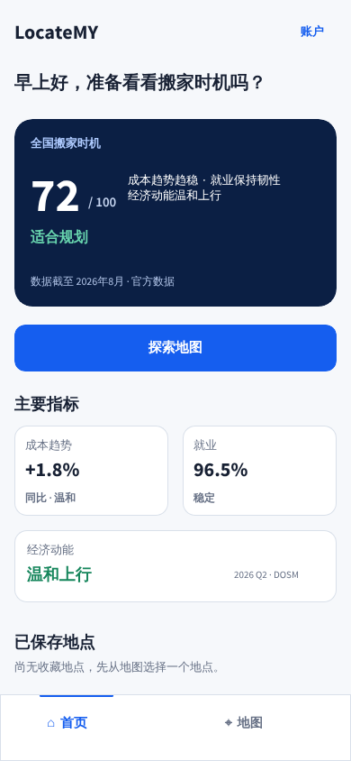
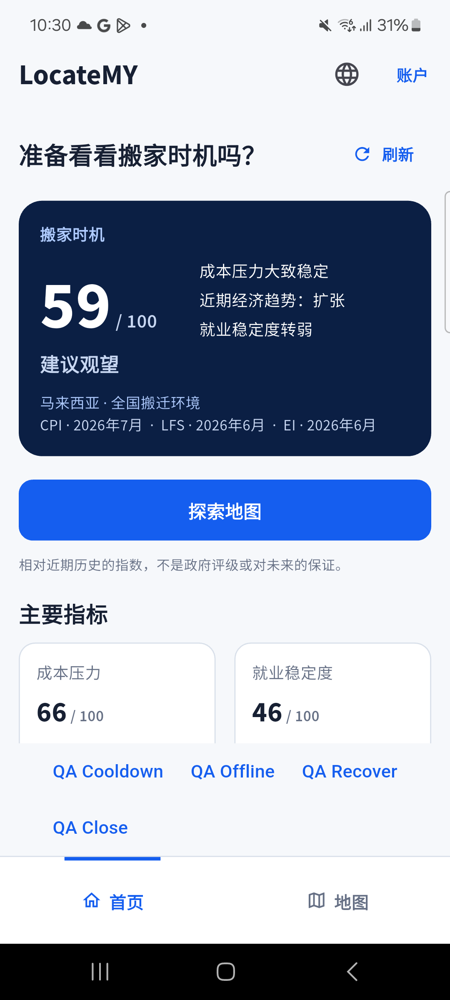
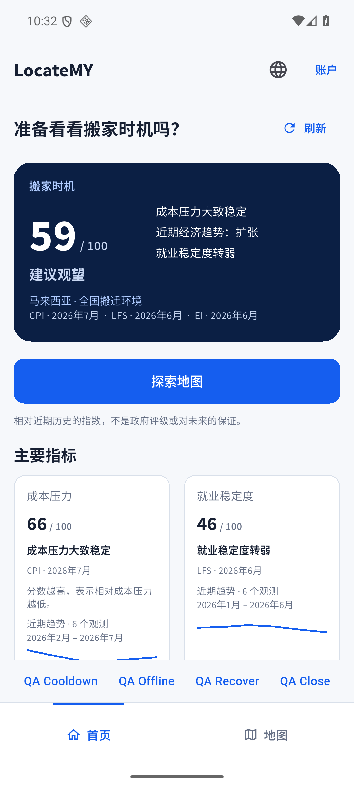

# Home：首页 Penpot 对照验收

通过 Penpot MCP 读取 `LocateMY Mobile UI` 的 `02 · 首页`（390×844），并据此调整真实 Flutter 首页与 Shell。页面继续使用真实指标和独立数据日期；原型示例数值没有进入生产。

| 原型风格 | 实现 |
| --- | --- |
| 蓝色 `#155EEF`、浅灰底 `#F6F8FB` | 探索入口、导航与页面背景统一 |
| 深蓝 `#0B1F44` 主评分卡 | 20 圆角、18 内边距、52 号评分、浅蓝标签及绿色状态 |
| Source Sans Pro | 本地固定版本字体，400/600/700 字重，附 OFL 许可；中文采用系统回退 |
| 白色描边指标卡 | 14 圆角；常规尺寸双列，大字号单列 |
| 问候→评分→探索→指标 | 探索按钮位于指标之前；保留收入、真实趋势及数据说明 |
| 品牌、账户与底部导航 | 品牌字体、蓝色账户入口、横向图标标签、选中顶部指示线 |

字体来源：[Adobe 官方 Source Sans 仓库](https://github.com/adobe-fonts/source-sans)。字体固定版本和校验值见 `assets/fonts/source_sans_pro/provenance.json`。

为呈现真实合同信息，来源日期、收入卡、趋势和方法说明比原型更完整；200% 字号允许内容自然增高并滚动。原型的收藏地点属于其他能力，未加入本次首页。

## 验证与审查

公开页面的 CTA 顺序用例先失败再通过，使用既定四个 TDD 边界。全量测试 146 项通过，5 项 opt-in 跳过；真实 Home RPC/权限测试单独启用通过。静态分析无问题，格式检查无改动。

GPT-5.6 Luna High 的 Spec 与 Standards 两轴均通过，无代码阻塞；最终设备证据补充审查已通过，维持 Implemented。

## 四项交付状态

- 本模块完成度：Home 为 **Implemented**。
- 本期联合验收：真实 Home/Shell 及两设备验证通过。
- 后续联合责任：真实 Map 页面及 HOME-W4-05 完整联合场景，Owner A / Wave 4。
- 当前 Home 阻塞：无；整个 Wave 4 尚未完成，当前不声明 Integrated。

## 证据

App（含字体）SHA-256：`aa0ebdfff9b062e5c0c499d5f6f9ff732b78a37605cc99e1f9e91df8af183825`。

[设计参数](evidence/home-penpot-alignment-2026-09-17/penpot-design-reference.json)、[检查版本](evidence/home-penpot-alignment-2026-09-17/penpot-checks.source.json)、[Luna High 两轴结论](evidence/home-penpot-alignment-2026-09-17/luna-high-review.json)、[设备与清理](evidence/home-penpot-alignment-2026-09-17/device-verification-summary.json)。旧设备汇总已按当前版本重新生成，八份最终清单版本一致。截图中的 QA 操作栏仅来自隔离测试入口，普通 APK 已恢复。

### Penpot 原型

### 真机中文 / 模拟器中文

