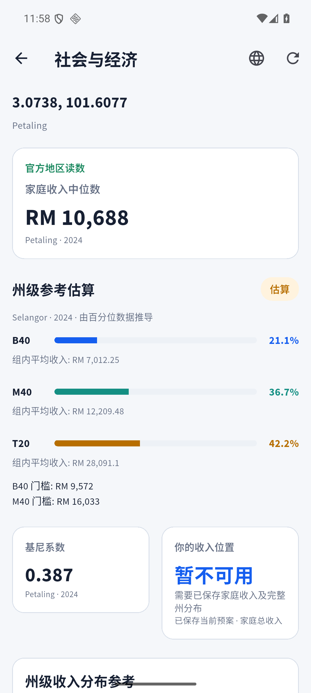
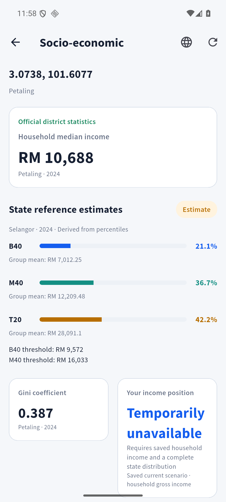
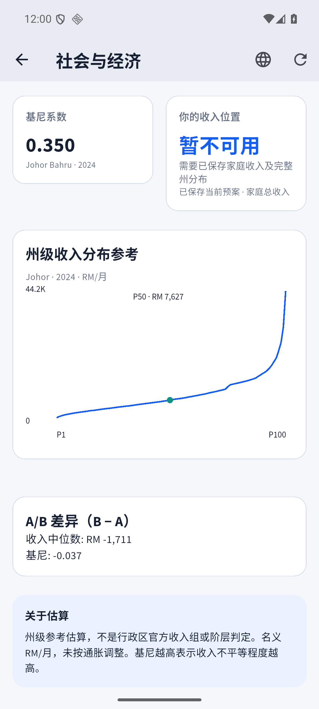
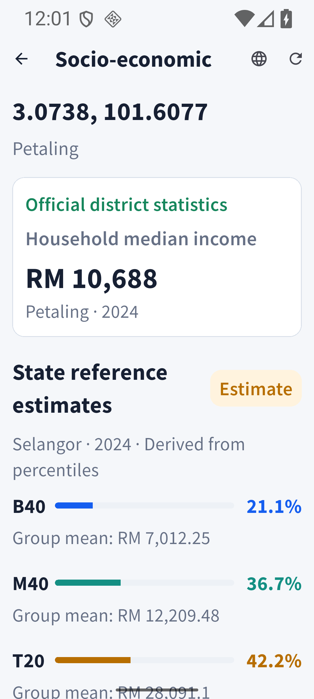

# Issue #25 Socio-economic 验收报告

2026-09-18。独立本地分支 `codex/socio-economic-feature`，隔离工作目录 `/home/AC79/Desktop/LocateMY-socio-economic`。实现提交 `d192281`，页内语言切换修复及回归提交 `86d352f`。未推送或合并。

## 模块实现

**Implemented**。GPT‑5.6 Luna High 独立审查并复审通过，当前规格问题为零、规范无硬性违规；[最终审查](luna-high-review.md)。

已实现真实地区收入／基尼、州回退、州收入结构与分布、已保存家庭总收入位置、A/B 可比性、三天公共缓存、离线恢复、重试与生命周期。UI 对照 Penpot `08 · 社会与经济` 的颜色、Source Sans Pro、16px 卡片与官方／估算分组；示例数字替换为真实读数。

按确认的公开边界逐片 TDD；工程检查：格式 192 文件零改动、静态分析零问题、全测试 277 通过／11 个 live gate 默认跳过；Socio live 单独启用通过、debug APK 构建及凭据扫描通过。真实 DOSM CSV 五个数据投影对照通过；authenticated 只读 allow、匿名及镜像写入 deny、私有 current owner allow／other owner deny 通过。

Android 36 x86_64 模拟器：单点、A/B、离线缓存、重试恢复、中英文、页内语言切换、200% 字体及退出登录全部通过。不声称额外真机验证。生产／设备源码 SHA-256：`b9c420f0ae7c7fd36eb4221a9c79b510a645ad3f78791cdcee9d32cebe2b12e7`；最终 APK／live／设备证据注明 `86d352f`。权限及官方源证据产生于相同数据路径实现 `d192281`，后续仅增加共享语言按钮。

可复跑命令和结果见 [checks.json](checks.json)，本目录保留无敏感信息的版本／权限／官方源证据；完整日志与构建物在本地 `build/socio-wave6-evidence/`。

## 本期集成

真实 Auth → Map 单点／A-B → Geo → Socio RPC／公共缓存与 Cost-owned current 只读入口联合路径通过；页面读取变化、失败撤回未确认个人位置、晚到／dispose 与退出登录已验证。

## 后续集成

完整预算编辑、删除、选择成功通知与 Socio 更新联合场景：B 主责，A 接线，最迟 Wave 6。完整预算上游尚未实现；本报告不宣告整个 Wave 6 完成。`Integrated` 仍待项目负责人跨 Owner 验收批准。

## 当前阻塞

无（Socio 当前模块责任）。Luna 初审语言入口问题已修复并复验；A/B 空断言判断经复核撤回，公开页面回归验证 A 不可用／B 可用无崩溃。

## 页面证据

